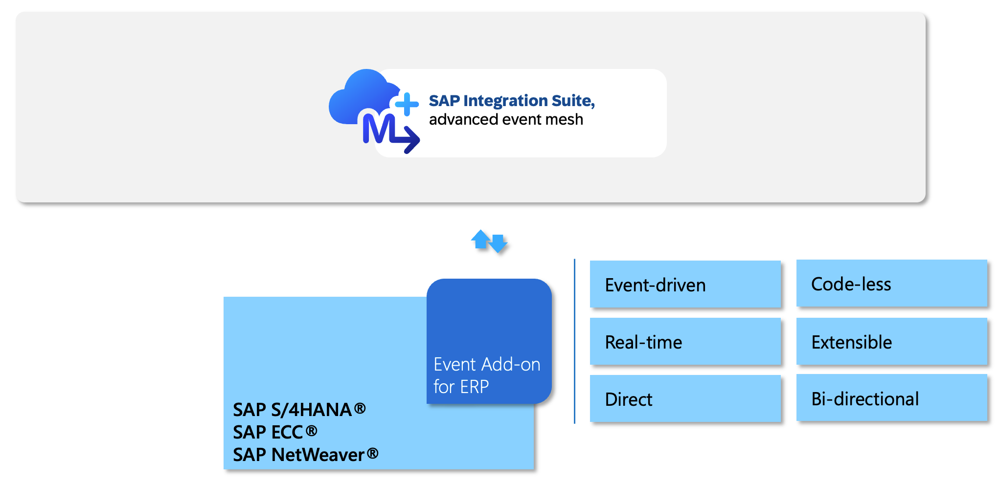
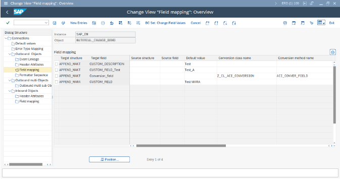

# Exercise 6 - A Taste of SAP S/4HANA Custom Events

After completing these steps you will have learned about how to create custom events for SAP S/4HANA (and ECC) using the Event Add-On for ERP. On top, you will have consumed one or more events from SAP S/4HANA.

## Exercise 6.1 The Event Add-On for ERP

The Event Add-On for ERP has lately been introduced to further improve event exposure options for SAP's event-driven ecosystem. Consider the Event-Add-On for ERP as a premium and convenience option that comes with a low-code/no-code approach to create sophisticated, clean-core compliant custom events in just a few minutes.

To keep it short let's describe what the Event-Add On is in a few sentences:

- The Event Add-On enables real-time, event-driven, bi-directional communication and batch loads from both SAP S/4HANA and SAP ERP Central Component (SAP ECC) to SAP Integration Suite, advanced event mesh.
- The Add-On is already available via SAP through various commercial models (BTPEA, CPEA, PAYG, Subscription via SAP Store).
- It supports different deployment options of SAP S/4HANA and SAP ECC (including on-premises and SAP S/4HANA, private cloud edition)
- It allows to create custom events in a code-less or alternatively pro-code way and offers extensible payloads
CDS views, classic tables, IDocs can be used for event payload creation
- Comes with templates for selected custom events
- Major parts of the technology have already been in successful use for several years and are now available in an SAP offering specifically tailored for SAP Integration Suite, advanced event mesh
- Scales to enterprise grade numbers of events exposed

Watch a 5 minute demo of the Event Add-On for ERP here. We will walk you through the creation of a Sales Order event in SAP S/4HANA.

In case you are interested in a detailed demo that you can watch later, find it here: [Devtoberfest 2025: Hands-on session: practival demonstration of the Event Add-On for ERP](https://www.youtube.com/watch?v=vwzqNLISvHo)

## Exercise 6.2 Consume Custom Events form SAP S(4HANA via the Event Add-On

Now that you have seen the event getting created, let us consume it in Advanced Event Mesh.

1. Go back to Advanced Event Mesh and go to the <b>Queue you had created earlier</b>. You can make things easier by searching for your Queue in the search field.

2. Click on <b>Subscription</b>

3. Subscribe for SAP S/4HANA Custom Event Topic 

4. 

## Summary

You've now explored how you scale your event-driven architecture.
